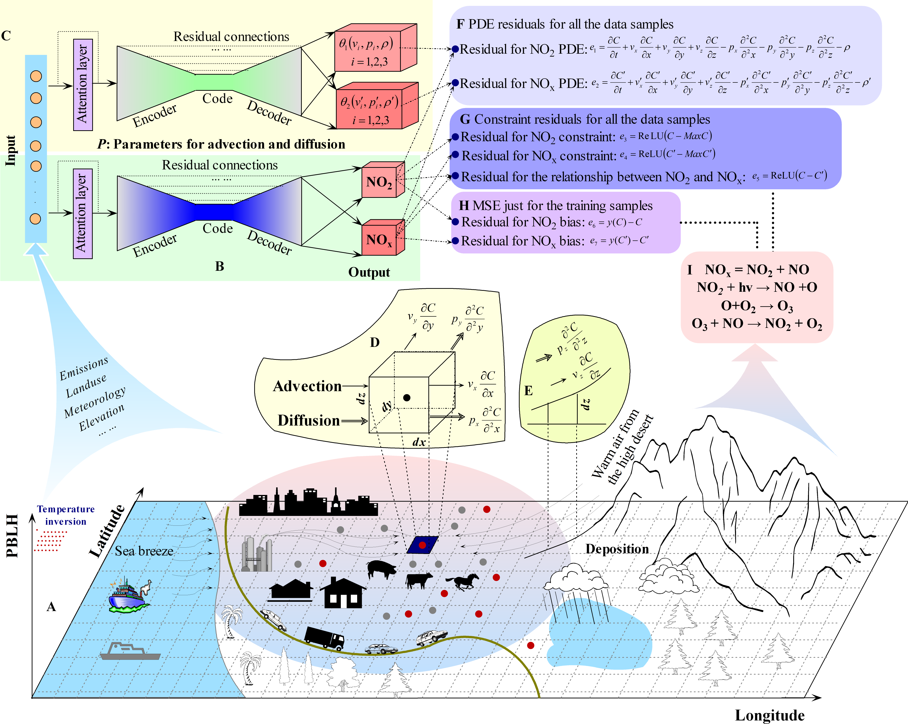

```{r setup, include=FALSE}
knitr::opts_chunk$set(echo = TRUE)
```

## Overview 
This library implements a joint Physics-Informed Neural Network (jPINN) approach that integrates physical principles into deep learning models for enhanced air pollutant concentration prediction (our paper, entitled ***Knowledge-informed Deep Learning to Mitigate Bias in Joint Air Pollutant Prediction***, to be published soon). The framework addresses limitations in traditional deep learning by incorporating multiple physical constraints:

{width=90% height=90%}

* ***PDE-based continuity formula*** Implements the equation: 
```math
    \frac{\partial\ C}{\partial\ t} = -\nabla(VC) + p \nabla^2C+R 
```
where $C$ is air pollutant concentration to be predicted, $\partial\ t$ denotes the time derivative, $\partial\ C /\ \partial\ t$ denotes air pollutant change in each grid cell or target location over time ($t$), $\nabla(VC)$ denotes advection, $V$ denotes velocity, $p$ denotes the coefficient for the diffusion term ($\nabla^2 C$), and $R$ denotes the total change by chemical transformation, emission and deposition. We just consider the modeling close to ground, not 3-d space due to mssing of vertical measurement data. 


* ***Concentration thresholds*** Enforces realistic maximum concentration boundaries for different pollutants.

* ***Pollutant relationship constraints*** Maintains known relationships between paired pollutants (e.g., NO<sub>2</sub> $\leq$ NO<sub>x</sub>).

* ***Observational accuracy***: Minimizes RMSE between predictions and labeled samples.

We leverage semi-supervised learning way to strengthen the relularity of the predicted target variables through PDE residual and physical constraints.

Theoretically, incorporating a large number of unsupervised samples helps reduce the upper bound of the generalization error, thus improving learning stability and generalization performance across out-of-distribution data and real-world applications: 
```math
\begin{align*}
    \varepsilon_G \leq C_{pd} \left(\varepsilon_{d,T} + \varepsilon_{p,T} + C_{q,d}^{\frac{1}{2}} N_d^{-\frac{\alpha_d}{2}} + C_{q,p}^{\frac{1}{2}}N_{\text{int}}^{-\frac{\alpha_p}{2}} \right)
    \label{eq:prf_core_generalizationerror}
\end{align*}
``` 

## Experiments 

We have evaluated the approach in two typical applications of different air pollutants and different regions.

+ For reactive NO<sub>2</sub> and NO<sub>x</sub> in California, our approach achieved unprecedented accuracy (R<sup>2</sup>: 0.95-0.96; RMSE: 1.57-3.95 ppb) in site-based independent testing (ensemble predictions), substantially outperforming conventional deep learning methods in control tests (R<sup>2</sup>: 0.53-0.75) and surpassing recent studies conducted in California or its subregions using standard cross-validation procedures (R<sup>2</sup>: 0.76-0.91).

+ For inert PM<sub>2.5</sub> and PM<sub>10</sub> across mainland China, our framework achieved exceptional accuracy (R<sup>2</sup>: 0.87-0.88; RMSE: 12.91 µg/m<sup>3</sup> for PM<sup>2.5</sup> and 21.03 µg/m<sup>3</sup> for PM<sub>10</sub>) in site-based independent testing, significantly outperforming both conventional deep learning approaches in control tests and recent studies utilizing cross-validation (R<sup>2</sup>: 0.78-0.84).

+ Simulation of proxy advection and diffusion fields: Our method's simultaneous generation of simulated proxy fields for advection and diffusion alongside paired air pollutant concentration prediction surfaces. These simulated fields primarily function as mathematical proxies for inverse problems within our PINN framework to mitigate bias and reduce generalization error, they transcend mere computational artifacts to become valuable diagnostic tools for atmospheric transport phenomena interpretation.

## jPINN Library 

This library provides the basic code for our jPINN model and ensemble learning. We also provide a baseline model for comparison.

The jPINN Library includes the following main modules:

+ Model implementation: model/phy2deepmodel.py 

  Model class: PhysicsResAutocoderPols 

  The core class for the encoding jPINN model that consists of two full residual deep networks, one for the main model to predict the dual target variables (e.g., NO<sub>2</sub> and NO<sub>x</sub>; PM<sub>2.5</sub> and PM<sub>10</sub>), and the other one for the parameters of inverse the proxy advection velocities, proxy diffusion coefficients and deposition etc. The model also provided the training function.  
   
+ Baseline FRNN implementation: model/baselinemodel.py 
  
  Model class: baselineFRNN 
  
  The baseline class without encoding physical constraints. It just outputs the concentration predictions. The model also provided the training function. 

+ Ensemble learning components: ensphymodel2train.py 
  
  Learning class: BtEnsPDEModelPols 
  
  The ensemble learning class that calls jPINN (Physics-Informed Neural Network) or a baseline FRNN (Full Residual Neural Network) for modeling pollutant distributions. This class handles data loading, preprocessing, model training with bootstrapping, and evaluation of physics-constrained deep learning models for environmental pollutant concentration prediction.
   
+ Example 1: ensembletraning_no2x.py 
   
   Example code to run the jPINN model.
   
+ Example 2: ensembletraning_no2x_baseline.py 
   
   Example code to run the baseline FRNN model.
   
## Setup  
  Currently, our code can be run under TensorFlow 2.11. We list all the required packages in the file, requirements.txt.
  
Environment requirements:
  
  + Python: 3.8 or 3.9; 
  
  + Packages: 
  
    - tensorflow==2.11
  
    - keras==2.11
  
    - numpy
  
    - pandas
  
    - scipy
  
    - scikit-learn
  
    - tqdm
  
    - resautonet

## Example  
Here we provide the [demo data](https://github.com/lspatial/jpinn_dataset). The data is based on our paper's example of NO<sub>2</sub> and NO<sub>x</sub> but these data are mainly from the Air Quality System (AQS) monitoring stations of the US EPA where the data are publically accessible. The field data from the unversities are removed from the data due to data security protocol. We will provide the example code to show how to run the program and finally show the final results. 

* Step 1: Load the conda environment:   
```{r reticulate}
library(reticulate)
use_condaenv("phy2no2x", required = TRUE)
py_config()
```

* Step 2: Load the packages in python: 
```{python}
import numpy as np
import os
import shutil
import tensorflow as tf
os.environ['TF_CPP_MIN_LOG_LEVEL'] = '2'
from data.phydatahelper import tcovs  
from ensphymodel2train  import BtEnsPDEModelPols
```

* Step 3: Initialization and data load
  Initialize the ensemble class with specified parameters, and load the data.  
```{python}
datafl='/deva/phy2data/merged_fdata_uploc_first.csv'
rootpath = '/devb/py2testing/demo_test'
mynoxensModel = BtEnsPDEModelPols(th_low=None, th_high=None, logno2max=5.5, lognoxmax=6.5, rootpath=rootpath)
mynoxensModel.loadData(datafl)
```

* Step 4: Data preprocessing 
  This includes the transformation, removal of invalid values and extraction of unsupervised data. 
```{python}
# Preprocess the data using the defined covariates
mynoxensModel.preprocessing(tcovs,outtype=2)
```

* Step 5: Setup the model name and paths for jpinn: 
```{python}
def modelingpath(rootpath,mflag): 
  modelPath = rootpath + '/model_' + str(mflag) + '/model' 
  samplepath = rootpath + '/model_' + str(mflag) + '/sample' 
  # Create or recreate the model directory
  if not os.path.exists(modelPath):
      os.makedirs(modelPath)
  # Create the sample directory for storing sampling results
  if not os.path.exists(samplepath):
      os.makedirs(samplepath)
  return samplepath,modelPath

# Create the path for saving the trained model
mflag = 'no2x_jpinn'
samplepath_jpinn,savepath_jpinn = modelingpath(rootpath,mflag)
```

* Step 6: jPINN training 
```{python  eval=FALSE}
# Train the model with specified parameters
# This trains an ensemble model for NOx prediction
# with 100 epochs, saving samples and the final model
mynoxensModel.ensAModel('newid2', 'source', 'month_date',nepoch=120,
         samplepath=samplepath_jpinn, savePath=savepath_jpinn)
```

* Step 7: Baseline path and data preprocessing for a single air pollutant (outtype: 0: NO2; 1: NOx; 2:both)

```{python}
mflag = 'no2x_baseline'
# Preprocess the data using the defined covariates
mynoxensModel.preprocessing(tcovs,outtype=0)
samplepath_baselin,savepath_baseline = modelingpath(rootpath,mflag)

```

* Step 8: Baseline training 
```{python  eval=FALSE}
mynoxensModel.ensBaselineModel('newid2', 'month_date', nepoch=120,
           samplepath=samplepath_baselin, savePath=savepath_baseline)                        
```

Once the training is finished, we can generate learning curves to visualize and compare performance across training, testing, and independent test performances.

To begin implementation, first read the training dataset:

```{r pressure, echo=FALSE}
library(readr)
rootpath='/devb/py2testing/demo_test'
tfl=paste(rootpath,'/model_no2x_baseline/model/train_tmp.csv',sep='')
baseline_metrics=read_csv(tfl) 
tfl=paste(rootpath,'/model_no2x_jpinn/model/train_tmp.csv',sep='')
jpinn_metrics=read_csv(tfl) 
```

Next, the results for R$^2$ are presented:

```{r,fig.height=12, fig.width=9}
par(mfrow=c(3,1),mar=c(4,4.5,1,1))
plot(jpinn_metrics$epoch,jpinn_metrics$train_r2_no2,type="l",col="black",cex.axis = 1.5,
     ylim=c(0,1),xlab="Epoch",ylab=expression("Train R"^2),lwd=2, cex.lab = 1.5)
lines(baseline_metrics$epoch,baseline_metrics$r2tensor,col="black",lty=3,lwd=2) 
legend(40,0.2,lty=c(1,3),col=c("black","black"),bty="n",cex = 1.5, x.intersp = 1,
       legend=c("jPINN","Baseline FRNN"), ncol = 2)

plot(jpinn_metrics$epoch,jpinn_metrics$test_r2_no2,col="blue",lwd=2,type="l",
      ylim=c(0,1.1),xlab="Epoch",ylab=expression("Test R"^2),cex.lab = 1.5,cex.axis = 1.5)
lines(baseline_metrics$epoch,baseline_metrics$val_r2tensor,col="blue",lty=3,lwd=2)
legend(40,1.1,lty=c(1,3),col=c("blue","blue"),bty="n",cex = 1.5, x.intersp = 1,
       legend=c("jPINN","Baseline FRNN"), ncol = 2)

plot(jpinn_metrics$epoch,jpinn_metrics$indtest_r2_no2,col="red",lwd=2,type="l",ylim=c(0,1.1),
     xlab="Epoch",ylab=expression("Independent test R"^2), cex.lab = 1.5,cex.axis = 1.5)
lines(baseline_metrics$epoch,baseline_metrics$ind_test_r2,col="red",lty=3,lwd=2)
legend(40,1.1,lty=c(1,3),col=c("red","red"),bty="n",cex = 1.5, x.intersp = 1,
       legend=c("jPINN","Baseline FRNN"), ncol = 2)

```
As demonstrated by the training curves for NO<sub>2</sub>, our jPINN model exhibits a consistent improvement in independent test R<sup>2</sup> values as training progresses. This stability in performance metrics contrasts significantly with the baseline model, which shows erratic fluctuations in both test and independent test R$^2$ values with limited overall improvement. The physics-informed architecture ultimately delivers approximately 10% higher R² values compared to the baseline FRNN in this comparative evaluation of a single model.

Next, the results for RMSE are presented: 
```{r,fig.height=12, fig.width=9}
par(mfrow=c(3,1),mar=c(4,4.8,1,1))
plot(jpinn_metrics$epoch,jpinn_metrics$train_rmse_no2,type="l",col="black",cex.axis = 1.5,
     ylim=c(0,30),xlab="Epoch",ylab=expression("Train RMSE(ppb)"),lwd=2, cex.lab = 1.5)
lines(baseline_metrics$epoch,baseline_metrics$rmsetensor,col="black",lty=3,lwd=2) 
legend(40,20,lty=c(1,3),col=c("black","black"),bty="n",cex = 1.5, x.intersp = 1,
       legend=c("jPINN","Baseline FRNN"), ncol = 2) 

plot(jpinn_metrics$epoch,jpinn_metrics$test_rmse_no2,col="blue",lwd=2,type="l",
      ylim=c(0,30),xlab="Epoch",ylab=expression("Test RMSE(ppb)"),
     cex.lab = 1.5,cex.axis = 1.5)
lines(baseline_metrics$epoch,baseline_metrics$val_rmsetensor,col="blue",lty=3,lwd=2)
legend(20,25,lty=c(1,3),col=c("blue","blue"),bty="n",cex = 1.5, x.intersp = 1,
       legend=c("jPINN","Baseline FRNN"), ncol = 2) 

plot(jpinn_metrics$epoch,jpinn_metrics$indtest_rmse_no2,col="red",lwd=2,type="l",
      ylim=c(0,30),xlab="Epoch",ylab=expression("Independent test RMSE(ppb)"),
     cex.lab = 1.5,cex.axis = 1.5)
lines(baseline_metrics$epoch,baseline_metrics$ind_test_rmse,col="red",lty=3,lwd=2)
legend(20,25,lty=c(1,3),col=c("red","red"),bty="n",cex = 1.5, x.intersp = 1,
       legend=c("jPINN","Baseline FRNN"), ncol = 2) 

```

Correspondingly, our jPINN's independent test RMSE for NO<sub>2</sub> shows a stable decrease as training epochs increase. This differs significantly from the baseline model's test and independent test RMSE, which displays unstable fluctuations with substantial deviations. Quantitatively, the jPINN's independent test RMSE is approximately 0.85 ppb lower than that of the baseline FRNN in this testing scenario. 

The stable convergence pattern observed during independent testing suggests that incorporating physical constraints fundamentally improves the model's generalization capabilities. This is particularly evident when the training extends for a sufficient number of epochs, where traditional deep learning approaches without physics-informed regularization fail to achieve stable and comparable site-based independent testing performance.

Furthermore, our ensemble learning implementation compounds these advantages, allowing the jPINN ensemble predictions to achieve significantly enhanced testing performance beyond what individual models deliver, as comprehensively documented in our paper. This reinforces the value of combining multiple physics-informed models to capture complementary aspects of the underlying physical phenomena.

Lianfa Li 
Contact: [Email](mailto:lspatial@gmail.com)

